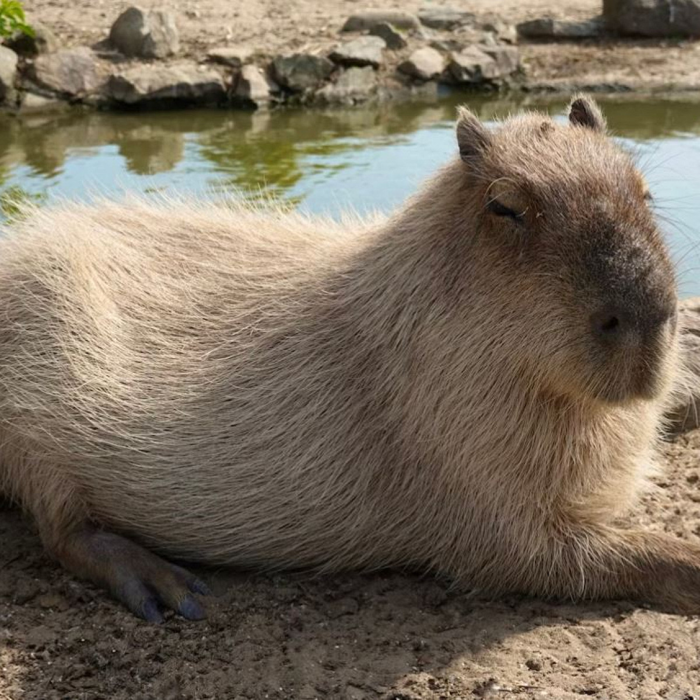
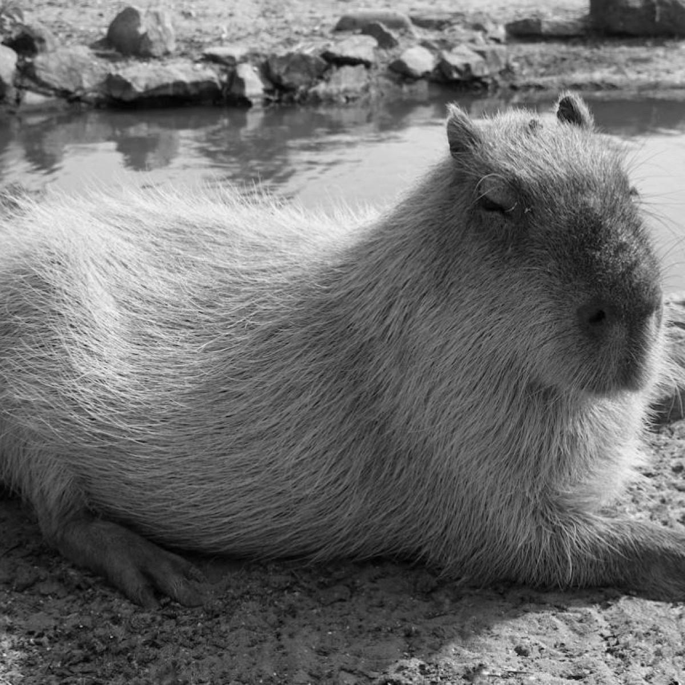

# Black and White Image Converter

## :pencil2: Description

This project is a script, what can convert new images are **multicolored** to the old images with **white-black** colors. The script was written on Python.
___

## :paintbrush: Color Converter

This script based on Python's library **Pillow**. This Library can get tools for work with images.
Algorithm take image's pixel's colors and art the new pixel with formula:
```
f = R * 0.299 + G * 0.587 + B * 0.114
```

With this **f** can get a new color is **RGB(f, f, f)**. The color will be new image's pixel.
Script get the image from chosen directory and based on this you can convert everyone image in all directories.

<p>


</p>
